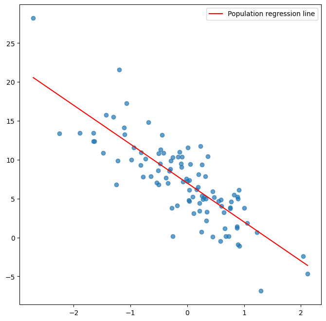
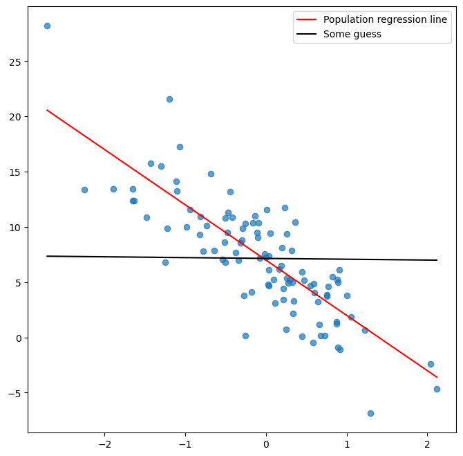
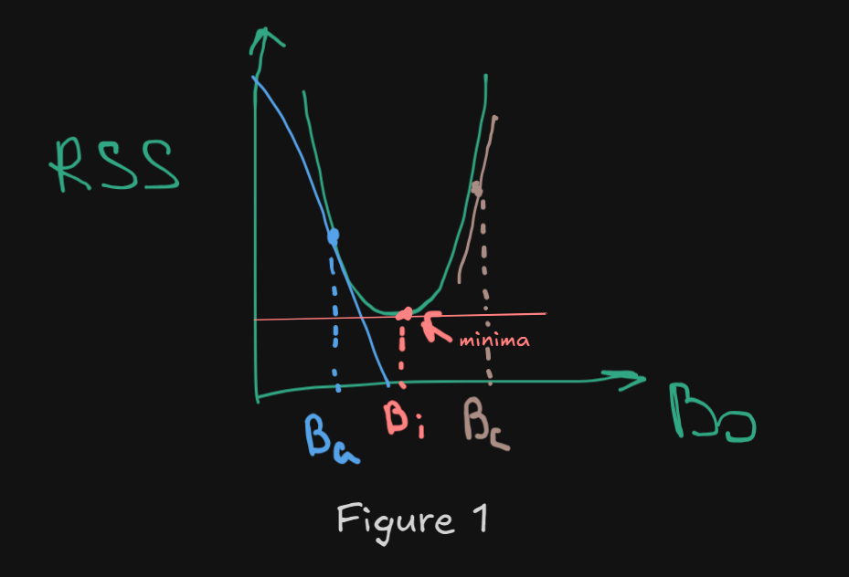
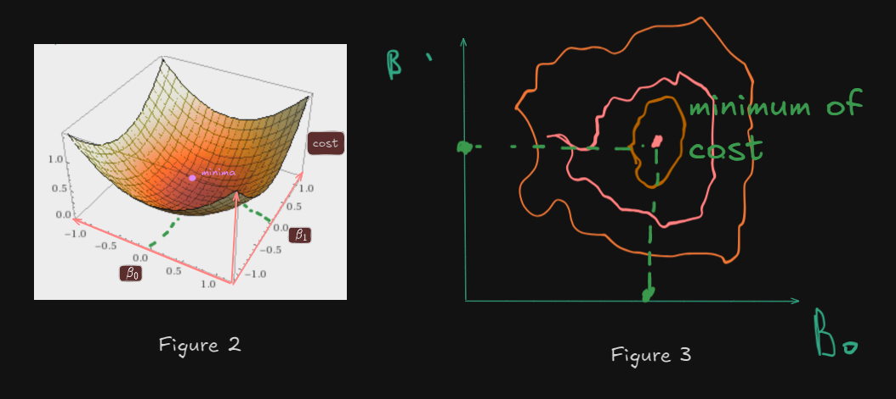
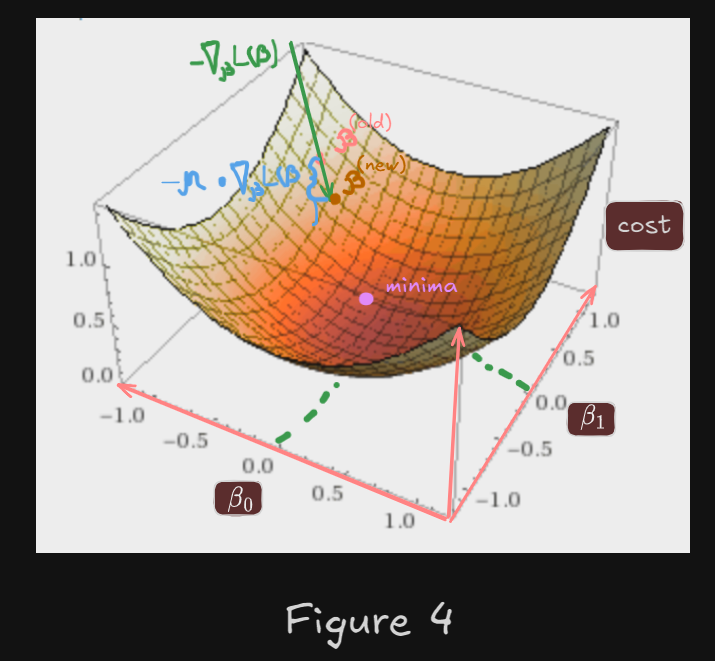

For example, here we generate some data, using linear regression model:
$$y = \beta_{0} + \beta_{1}X + e$$
$$y = 7-5X + e$$

And above we see those generated data, and `population regression line` since we know all values of coefficients in the epxression

Bun in real world - we do not know the coefficients, we have only x`s and y, so, here is the question, how observe the values of these coefficients?

One good way to do it - `gradient descent`

First of all, we need some `loss(cost) function`, which measures how our predictions far from true. Here, as a loss function, i will use `RSS(residual sum of squares)`:

Data $(x_{i1},\ldots,x_{ip},y_i)$ for $i=1,\ldots,n$.
Model:
$$\hat{y}_i = \beta_0 + \sum_{j=1}^p \beta_j x_{ij}.$$
Loss (RSS):

$$
\operatorname{RSS}(\beta) = \sum_{i=1}^n (y_i - \hat{y}_i)^2 = \sum_{i=1}^n \left(y_i - \beta_0 - \sum_{j=1}^p \beta_j x_{ij}\right)^2.
$$

,
and this function takes as an input - set of $\beta$ coeffcients, and our task - is to find those combintation, that `minimizes the cost`

In order to minimize cost function, we can take a derivate of it, and see, is the slope equals to zero at certain pair of $\beta$ coefficients, because this will mean what we are in the minima

At **Figure 1**, taking derivative of RSS with respect to b0 tells us: with a tiny change of $\beta_{0}$, how RSS will change?

- if we take $\beta_{a}$ as an coefficients - the slope of a tangent line will be negative, which tells us, that RSS is decreasing, but its not minima
- if we take $\beta_{c}$ as a coefficients that reduces RSS - we will get positive slope, which says that RSS is increasing - this is not our goal
- but if we take $\beta_{i}$, we see that the slope at that point is zero and it say TO STOP,
  because better result we will never get(if this is global minima)

At **Figure 2** and **Figure 3** we can see this in a 3D

So, this images are all great(i hope you liked it) and this words are fantastic, but how actually compute it?
Oh, this is not hard. The algorithm:

#### Step 1: Finding the Direction of Steepest Ascent (The Gradient)

To find the minimum of a function in a multi-dimensional space, we first need to know which way is **"up"** (the steepest increase). This direction is given by the **gradient**.

In higher dimensions, the derivative of a function $L$ with respect to a vector of parameters $\beta$ is called the **gradient**, denoted $\nabla_\beta L(\beta)$. It's a vector containing the partial derivative for each parameter:

$$
\nabla_\beta L(\beta) =
\begin{bmatrix}
\frac{\partial L}{\partial\beta_1} \\
\frac{\partial L}{\partial\beta_2} \\
\vdots \\
\frac{\partial L}{\partial\beta_n}
\end{bmatrix}
$$

- $L(\beta)$ is the **Cost Function** (or Loss Function), which quantifies how far off our model's predictions are from the true values.
- $\beta$ represents the vector of **Coefficients** (or parameters) we are trying to optimize.

The gradient $\nabla_\beta L(\beta)$ tells us: "For a tiny change in any single parameter $\beta_i$, how much will the cost $L$ be affected?" Crucially, the entire gradient vector points in the direction where the cost function **increases the fastest**.

Since our goal is to find the minimum, we must move in the opposite direction—the direction of the fastest **decrease**. Therefore, we use the **negative gradient**:

$$-\nabla_\beta L(\beta)$$

---

#### Step 2: Evaluating the Current Position

We begin by taking some **initial values** for our parameters, $\beta^{\text{(old)}}$. We then substitute these values into the gradient expression, $\nabla_\beta L(\beta)$.

- If the magnitude of the gradient at this point is **zero** or very close to zero, it means we are at a **local minimum** (or potentially a maximum or saddle point) where the slope is flat.
- If the gradient is **non-zero**, it signals that the function is still sloping, and we need to **"go deeper"** (move further down the cost surface).

---

#### Step 3: Taking a Step Towards the Minimum (The Update Rule)

If we are not yet at a minimum, we need to calculate a new, improved set of parameters, $\beta^{\text{(new)}}$. This is where the core **Gradient Descent Update Rule** comes into play:

$$\beta^{\text{(new)}} = \beta^{\text{(old)}} - \eta \cdot \nabla_\beta L(\beta)$$

This formula dictates how to update the parameters based on the direction of steepest descent.

Here's a breakdown of the components:

|          Term           |        Name         | Role and Significance                                                                                                                                                               |
| :---------------------: | :-----------------: | :---------------------------------------------------------------------------------------------------------------------------------------------------------------------------------- |
| $\beta^{\text{(new)}}$  | **New Parameters**  | The updated set of coefficients after taking one optimization step.                                                                                                                 |
| $\beta^{\text{(old)}}$  | **Old Parameters**  | The current coefficients before the update.                                                                                                                                         |
|         $\eta$          |  **Learning Rate**  | A crucial **hyperparameter** that controls the **step size**. A small $\eta$ means slow convergence but potentially better accuracy; a large $\eta$ risks overshooting the minimum. |
| $\nabla_\beta L(\beta)$ | **Gradient Vector** | The direction of **steepest ascent** for the loss function.                                                                                                                         |
|           $-$           |   **Subtraction**   | Ensures we move in the direction **opposite** to the gradient (the direction of steepest **descent**).                                                                              |

---

## 

#### Step 4: Iteration and Convergence

The process is inherently **iterative**. We treat the new parameters, $\beta^{\text{(new)}}$, as the old parameters for the next iteration.

We **repeat** steps 1 through 3 until a **convergence criterion** is met. This often means:

1.  The magnitude of the gradient is extremely small (approaching zero).
2.  The cost function $L(\beta)$ stops changing significantly between successive steps.
3.  A maximum number of iterations (epochs) has been reached.

By continuously following the negative gradient, we guarantee that with each step, the cost function $L(\beta)$ will decrease (assuming a properly chosen learning rate $\eta$), eventually leading us to the lowest point on the cost surface.

See the code implementation in the file above, hope you enjoy it!
